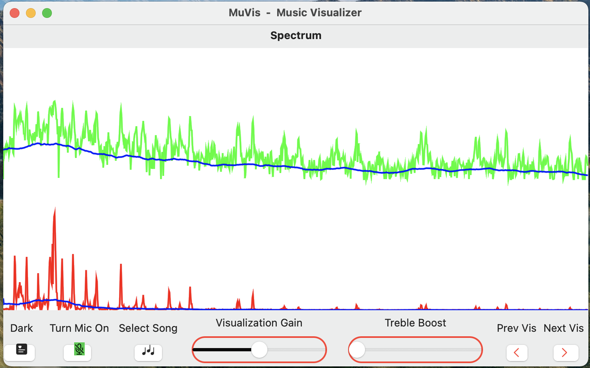

#  MuVis - an Audio Visualizer app for Music
#  MuVis User Guide
by Keith Bromley, San Diego, CA, USA &nbsp; &nbsp; kbromley@me.com

When the MuVis app first opens, the on-screen display should look somewhat like:

and the computer's speakers should be playing music from a pre-loaded royalty-free music file. (Currently, the song file is "The Elevator Bossa Nova" from Bensound.com.)  The on-screen display shows a real-time dynamic visual representation of the audio that you are hearing.

Click-and-drag any corner of this window to freely re-size it to any width and height you wish.  Some users like tall thin windows; some like short wide windows; while I prefer approximately square windows.

On a Mac, the menu bar at the top shows the app's title "MuVis - Music Visualizer", and the toolbar beneath it shows the name "Spectrum" of the particular visualization selected for display.  (These are omitted on an iPhone or iPad, to allow more screen space for the visualizations.)  The bottom toolbar contains buttons and sliders to allow you to control what you see.

At the bottom right are two buttons labelled "Prev Vis" (Previous Visualization) and "Next Vis" (Next Visualization) which allow you to cycle through the twenty-or-so visualizations currently provided by the app.  As a convenient keyboard-shortcut, you also can simply use the left-arrow and right-arrow keyboard keys to cycle back-and-forth among these visualizations.  The document titled Visualizations.md describes the purpose of each visualization - probably in more detail than you want.

Some of the visualizations are very graphics-intensive and freeze my iPad, so I have reduced some of the parameters (notably the muSpecHistoryCount from 32 to 16) when running on iOS devices.

At the bottom left is a button labelled "Light" which when-clicked toggles the app's window to Light Mode.  (Alternatively, if the window is currently in Light Mode, the button label will be "Dark" and when-clicked will toggle the window into Dark Mode.)  Different visualizations look subjectively better or worse in either Light or Dark Mode.  Feel free to pick your favorites.

The adjacent button is labelled "Turn Mic On".  When pressed it stops playing the audio from the selected song file (and also stops it's visualization), and starts playing the live audio from the microphone (and starts it's visualization).  The label then becomes "Turn Mic Off" - which, when pressed, performs the reverse actions.

The next button is labelled "Select Song".  (It is disabled and grayed-out if the microphone is enabled.)  When the button is clicked, a sub-window pops us looking somewhat like:


On a Mac, it allows you to select whatever songs you want from your own Music folder.  Selecting a song (by navigating your Artist and Album structures and clicking on its name) causes that song to play - and the visualization to render its dynamic attributes.  Unfortunately, on an iPhone or iPad, the pop-up window allows access only to songs loaded into your iCloud Drive folder.  (Apple allows only its own Music app to have access to songs in the music library.) 

The bottom toolbar also contains two sliders - one labelled "Visualization Gain" and the other labelled "Visualization Treble Boost".  As their names imply, sliding them adjusts the gain and slope of the visual data representation.  (Note that they do NOT adjust the audio levels of the music your are hearing.)  They allow subjectively adjusting the display to be the most pleasing - despite whether the musical passage is very quiet or very loud.

For convenience, I have enabled keyboard shortcuts for some of these buttons:   
pressing the keyboard's left-arrow key presents the Previous Visualization;  
pressing the right-arrow key presents the Next Visualization;  
pressing the up-arrow key toogles between light- and dark-mode; and   
pressing the down-arrow key calls the Select Song pop-up window.

