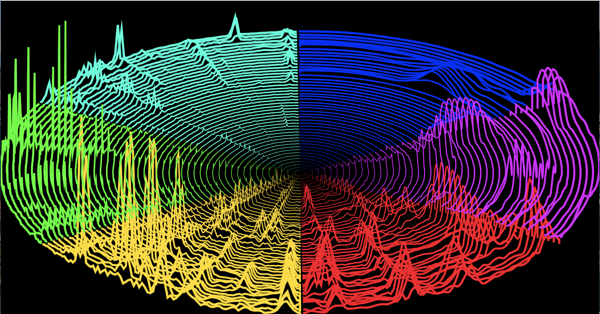

#  MuVis - an Audio Visualizer app for Music
#  MuVis Visualizations
by Keith Bromley, San Diego, CA, USA &nbsp; &nbsp; kbromley@me.com

There are currently about twenty visualizations included in the MuVis app.  They can be divided into three categories:  (1) one-dimensional spectrum graphs, (2) two-dimensional spectra (i.e., octave-aligned spectra) and (3) aesthetically-pleasing dynamic depictions of the spectral history.  Most of these visualizations were transcribed into Swift / SwiftUI from versions I had previously written in java for the Polaris audio player project  ( [www.logicbind.io/polaris](www.logicbind.io/polaris) ) over the previous several years.  (The sole exception to this is the SpectrumBars visualization.)

These descriptions are correct as of August 2021.  Since the MuVis app will continue to evolve, and since the documentation might not be updated in synchronization with the code, these may differ slightly from what you see in future versions of the MuVis app.

For this document, the visualization pictures I have selected show a white background ("light mode") for the first several, and a black background ("dark mode") for the later ones.  Feel free to look at both and choose your favorite.

For each one, here's a brief description of what I attempted to capture in the algorithms, coding, and graphics:

## Spectrum



This view renders a visualization of the simple one-dimensional spectrum (using a mean-square amplitude scale) of the music.  To be more accurate is renders a halfSpectrum in that it renders only the first 1,024 of the 2,048 bins.

In the lower plot, the horizontal axis is linear frequency (from 0 Hz on the left to about 5512 / 2 = 2,756 Hz on the right).  The vertical axis shows (in red) the mean-square amplitude of the instantaneous spectrum of the audio being played.  The red peaks are spectral lines depicting the harmonics of the musical notes being played.  The blue curve is a smoothed average of the red curve (computed by the findMean function within the SpectralEnhancer class).  The blue curve typically represents percussive effects which smear spectral energy over a broad range.

The upper plot (in green) is the same as the lower plot except the vertical scale is decibels (over an 80 dB range) instead of the mean-square amplitude.  This more closely represents what the human ear actually hears.

## MuSpectrum



This view renders a visualization of the muSpectrum (using a mean-square amplitude scale) of the music. I have coined the name muSpectrum for the exponentially-resampled version of the spectrum to more closely represent the notes of the musical scale.

In the lower plot, the horizontal axis is exponential frequency - from the note C1 (about 33 Hz) on the left to the note B6 (about 1,976 Hz) on the right.  The vertical axis shows (in red) the mean-square amplitude of the instantaneous muSpectrum of the audio being played.  The red peaks are spectral lines depicting the harmonics of the musical notes being played - and cover six octaves.  The blue curve is a smoothed average of the red curve (computed by the findMean function within the SpectralEnhancer class).  The blue curve typically represents percussive effects which smear spectral energy over a broad range.

In the upper plot, the green curve is simply the red curve after subtracting the blue curve.  This green curve would be a good starting point for analyzing the harmonic structure of an ensemble of notes being played to facilitate automated note detection.

## Spectrum Bars



This is basically the same as the muSpectrum plot - but with much fancier dynamic graphics.  (The notes are different because the music is different between capturing the two plots.)

This visualization was copied from Matt Pfeiffer's tutorial "Audio Visualizer Using AudioKit and SwiftUI" (See [here](https://audiokitpro.com/audiovisualizertutorial).)  (And see [here](https://github.com/Matt54/SwiftUI-AudioKit-Visualizer) for the source code.)

I believe that this is copied from the FFTView visualization within the AudioKitUI framework.  (See [here](https://github.com/AudioKit/AudioKitUI/tree/main/Sources/AudioKitUI/Visualizations).)

## Linear OAS



The LinearOAS visualization is similar to the muSpectrum visualization in that it shows an amplitude vs. exponential-frequency spectrum of the audio waveform.  The horizontal axis covers a total of 72 notes (i.e., 6 octaves) from C1 (about 33 Hz) to B6 (about 1,976 Hz).  For a pleasing effect, the vertical axis shows both an upward-extending muSpectrum in the upper-half screen and a downward-extending muSpectrum in the lower-half screen.

We have added a piano-keyboard overlay to clearly differentiate the black notes (in gray) from the white notes (in white).  Also, we have added note names for the white notes at the top and bottom.

The spectral peaks comprising each note are a separate color.  The colors of the grid are consistent across all octaves - hence all octaves of a "C" note are red; all octaves of an "E" note are green, and all octaves of a "G" note are light blue, etc.  Many of the subsequent visualizations use this same note coloring scheme. I have subjectively selected these to provide high color difference between adjacent notes.

	NoteC_Color		    red = 1.0	green = 0.0	blue = 0.0	// red
	NoteCsharp_Color	red = 1.0	green = 0.5	blue = 0.0
	NoteD_Color		    red = 1.0	green = 1.0	blue = 0.0	// yellow
	NoteDsharp_Color	red = 0.1	green = 1.0	blue = 0.0
	NoteE_Color		    red = 0.0	green = 1.0	blue = 0.0	// green
	NoteF_Color		    red = 0.0	green = 1.0	blue = 0.7
	NoteFsharp_Color	red = 0.0	green = 1.0	blue = 1.0	// cyan
	NoteG_Color		    red = 0.0	green = 0.5	blue = 1.0
	NoteGsharp_Color	red = 0.0	green = 0.0	blue = 1.0	// blue
	NoteA_Color		    red = 0.5	green = 0.0	blue = 1.0
	NoteAsharp_Color	red = 1.0	green = 0.0	blue = 1.0	// magenta
	NoteB_Color		    red = 1.0	green = 0.0	blue = 0.7

In the above figure, the leftmost purple peak is the fundamental (harm=1) note A1 (exactly 55 Hz) and the five purple peaks to the right of it are: the harm=2 harmonic A2 (110 Hz), the harm=4 harmonic A3 (220 Hz), the harm=8 harmonic A4 (440 Hz), the harm=16 harmonic A5 (880 Hz), and the harm=32 harmonic A6 (1,760 Hz).  The four green peaks are:  the harm=3 harmonic E3 (165 Hz), the harm=6 harmonic E4 (330 Hz), the harm=12 harmonic E5 (660 Hz), and the harm=24 harmonic E6 (1,318 Hz).

The visual appearance of this spectrum is of each note being rendered as a small blob of a different color.  However, in fact, we implement this effect by having static vertical blocks depicting the note colors and then having the non-spectrum rendered as one big white /dark-gray blob covering the non-spectrum portion of the spectrum display.  The static colored vertical blocks are rendered first; then the dynamic white / dark-gray big blob; then the gray "black notes"; and finally the note names.

## Overlapped Octaves



The OverlappedOctaves visualization is a variation of the upper half of the LinearOAS visualization - except that it stacks notes that are an octave apart.  That is, it has a grid of one row tall and 12 columns wide.  All of the "C" notes are stacked together (i.e., a ZStack) in the left-hand box; all of the "C#" notes are stacked together (i.e., a ZStack) in the second box, etc.  We use the same note color coding scheme as used in the LinearOAS.

We overlay a stack of 7 octaves of the muSpectrum with the lowest-frequency octave at the back, and the highest-frequency octave at the front.  The octave's lowest frequency is at the left pane edge, and it's highest frequency is at the right pane edge.

Each octave is a standard spectrum display (converted from linear to exponential frequency) covering one octave. Each octave is overlaid one octave over the next-lower octave.  (Note that this requires compressing the frequency range by a factor of two for each octave.)

The leftmost  column represents all of the musical "C" notes, that is: notes  0, 12, 24, 36, 48, and 60.  The rightmost column represents all of the musical "B" notes, that is: notes 11, 23, 35, 47, 59, and 71.

Overlaying this grid is a color scheme representing the white and black keys of a piano keyboard. Also, the name of the note is displayed in each column.

## Octave Aligned Spectrum (OAS)



The OctaveAlignedSpectrum (OAS) visualization is one of the bedrock visualizations of this app.  It is similar to the LinearOAS visualization except that the octaves are laid out one above the other.  This is ideal for examining the harmonic structure.  (I believe the above picture shows a D7 chord consisting of the notes D, F#, A, and C.)

The graphical structure depicted above is a grid of 7 rows by 12 columns.  Each of the 7 rows contains all 12 notes within that one octave.  Each of the 12 columns contains 7 octaves of that particular note.  If we render with a resolution of 8 points per note, then each row contains 12 * 8 = 96 points, and the entire grid contains 96 * 7 = 672 points.

Each octave is a standard spectrum display (converted from linear to exponential frequency) covering one octave. Each octave is overlaid one octave above the next-lower octave.  (Note that this requires compressing the frequency range by a factor of two for each octave.)

We typically use the muSpectrum array to render it.  But we could render it directly from the Spectrum array.  The top row would show half of the spectral bins (but over an exponential axis).  The next-to-the-top row would show half of the remaining bins (but stretched by a factor of 2 to occupy the same length as the top row).  The next-lower-row would show half of the remaining bins (but stretched by a factor of 4 to occupy the same length as the top row).  And so on.  Observe that the bottom row might contain only a small number of bins (perhaps 12) whereas the top row might contain a very large number of bins (perhaps 12 times two-raised-to-the-sixth-power).  The resultant increased resolution at the higher octaves might prove very useful in determining when a vocalist is on- or off-pitch.

## Octave Aligned Spectrum 2



The OctaveAlignedSpectrum2 visualization is exactly the same as the OctaveAlignedSpectrum visualization except that the each note-within-the-octave is rendered in a different color - based on the same note coloring scheme used in the LinearOAS visualization.

## Elliptical OAS



The  EllipticalOAS visualization renders the same muSpectrum information as the OctaveAlignedSpectrum, but displays it as a series of concentric ellipses instead of as rows in a Cartesian grid. Each ellipse of this set is a standard muSpectrum display covering one octave of frequency. Each ellipse is scaled and aligned one octave above the next-inner ellipse to show the radial alignment of octave-related frequencies in the music.

The parametric equations for a circle are

		x = r sin (2 * PI * theta)
		y = r cos (2 * PI * theta)
where the angle theta (in radians) is measured clockwise from the vertical axis.
Since our rendering pane is rectangular (instead of square), we should generalize this to be an ellipse in order to maximally fill the rendering pane.  The parametric equations for an ellipse are

		x = A sin (2 * PI * theta)
		y = B cos (2 * PI * theta)
where A and B are the major- and minor-radii respectively.  (Strictly speaking, theta is no longer the desired geometric angle, but the approximation becomes more accurate as A = B.)

In the render() method, for each of the 7 ellipses (i.e., for each octave of spectral data) we:

1.) Start defining a multi-segmented line with a starting point at the twelve o'clock position on the appropriate ellipse,
2.) Add points to the line as we navigate counter-clockwise around the ellipse,
3.) When we get all the way around to the twelve o'clock position again, we reverse direction and add more points as
    we move clockwise around the ellipse,
4.) During this latter path, we add the spectral bin value to the radius of the ellipse so that the curve has outward
    bumps representing the spectral peaks,
5.) When we get all the way around to the original starting point, we close the line segments to create an enclosed
    "blob".
6.) Finally, we fill this blob with a desired fill color. (I like the pomegranate color shown above.)

## Spiral OAS



The SpiralOAS visualization renders the same muSpectrum information as the OctaveAlignedSpectrum, but displays it along a spiral instead of as rows in a Cartesian grid. Each 360-degree revolution of this spiral is a standard muSpectrum display covering one octave of frequency. Each revolution is scaled and aligned one octave above the next-inner revolution to show the radial alignment of octave-related frequencies in the music.

The LinearOAS visualization had the nice property that all of the muSpectrum bins were adjacent to their neighbors, but it was poor at identifying harmonic relationships.  The OctaveAlignedSpectrum and EllipticalOAS visualizations were much more helpful in showing harmonic spectral relationships and identifying musical notes, but sacrificed the continuity between neighboring spectral bins.  (That is, as the audio frequency of a tone increased, it could disappear off of the right end of one row and reappear at the left end of the next-higher row.)  This SpiralOAS visualization attempts to get the best of both worlds.  It has the same harmonic alignment properties of the EllipticalOAS visualization while having all spectral bins uniformly rendered contiguously along one continuous line (namely, the spiral).  In other words, the graphic representation more closely resembles the physics of the sound being analyzed.

The parametric equations for a circle are

		x = r sin (2 * PI * theta)
		y = r cos (2 * PI * theta)
where r is the radius and, the angle theta (in radians) is measured clockwise from the vertical axis.

The spiral used in this visualization is called the "Spiral of Archimedes" (also known as the arithmetic spiral) named after the Greek mathematician Archimedes.  In polar coordinates (r, theta) it can be described by the equation

		r = b * theta
where b controls the distance between successive turnings.

Straight lines radiating out from the origin pass through the spiral at constant intervals (although not at right angles).  We will use the variable name "radInc" for this constant "radial increment".  The parametric equations for an Archimedean spiral are

		x = b * theta * sin (2 * PI * theta)
		y = b * theta * cos (2 * PI * theta)
where theta is the angle in radians (measured clockwise from the 12 o'clock position).  The counterclockwise spiral is made with positive values of theta, and the clockwise spiral (used here) is made with the negative values of theta.

Since our rendering pane is rectangular (as opposed to being square) , we will generalize this to be an elongated spiral in order to maximally fill the rendering pane.  The new parametric equations for the spiral are

		x = A * theta * sin (2 * PI * theta)
		y = B * theta * cos (2 * PI * theta)
where A and B are related to the major- and minor-radii respectively.  I do NOT claim mathematical correctness in	 these equations.  They appear to work nicely for this visualization.  But anyone using this for scientific purposes should re-verify that these shortcuts work for their purposes.

The following "trick" makes the rendering of the spiral more understandable.  We define a variable called "spiralIndex" whose integer part specifies the octave (turn number), and whose fractional part specifies the angle (theta) around that turn.  As spiralIndex goes from 0 to 1, the spiral makes a complete revolution.  As spiralIndex goes from 1 to 2, the spiral makes another complete revolution.  etc.  We want 0 <= theta <= 1.0 so we can evenly spread the bins comprising one octave over one revolution.    Hence, the actual spiral parametric equations that we will use are:

		x = X0 + ( radIncA * spiralIndex * sin(2.0 * PI * spiralIndex) );
		y = Y0 + ( radIncB * spiralIndex * cos(2.0 * PI * spiralIndex) );
where X0, Y0 are the coordinates of the desired origin (e.g., the pane's center) and radIncA and redIncB are the constant radial intervals in the horizontal and vertical directions.

A Google search uncovered the patent US5127056A ( [www.google.com/patents/US5127056](www.google.com/patents/US5127056) ) for a "Spiral Audio Spectrum Display System".  It was filed in 1990 by Allen Storaasli. It states that "Each octave span of the audio signal is displayed as a revolution of the spiral such that tones of different octaves are aligned and harmonic relationships between predominant tones are graphically illustrated."

## Harmonic Alignment



The HarmonicAlignment visualization is an enhanced version of the OctaveAlignedSpectrum visualization - which renders a muSpectrum displaying the FFT frequency bins of the live audio data on a two-dimensional Cartesian grid.  Each row of this grid is a standard muSpectrum display covering one octave. Each row is aligned one octave above the next-lower row to show the vertical alignment of octave-related frequencies in the music.  (Note that this requires compressing the frequency range by a factor of two for each octave.)  Hence the six rows of our displayed grid cover six octaves of musical frequency.

We have an audio sampling rate of 11,025 samples per second which means that the highest frequency we can observe is 11,025 / 2 = 5,512.5 Hz.  This implies that the highest musical note that we can reliably observe is E8 (freqE8 is about 5,274 Hz).  If C1 is considered as note = 0 then E8 is note = 88.  Thus the muSpectrum (generated from the spectrum computed by the FFT) covers a total of 89 notes (just over 7 octaves).

The bottom 6 octaves (the 72 notes from 0 to 71) will be displayed as possible fundamentals of the notes in the music, and the remaining 89 - 72 = 17 notes will be used only for harmonic information.  The rendered grid (shown in the above picture) has 6 rows and 12 columns - containing 6 * 12 = 72 boxes.  Each box represents one note.
In the bottom row (octave 0), the leftmost box represents note  0 (C1 is   33 Hz) and the rightmost box represents note 11 (B1 is   61 Hz).
In the top    row (octave 5), the leftmost box represents note 60 (C6 is 1046 Hz) and the rightmost box represents note 71 (B6 is 1975 Hz).

But the novel feature of the HarmonicAlignment visualization is the rendering of the harmonics beneath each note.  We are rendering 6 harmonics of each note. We will start counting from 1 - meaning that harm=1 refers to the fundamental.
If the fundamental is note C1, then:

	harm=1  is  C1  fundamental
	harm=2  is  C2  octave                                  harm=3  is  G2
	harm=4  is  C3  two octaves         harm=5  is  E3      harm=6  is  G3
So, harmonicCount = 6 and  1 <= harm <= 6
The harmonic increment (harmIncrement) for our 6 rendered harmonics is 0, 12, 19, 24, 28, 31 notes.

We use the following values of hue to assign colors to these harmonics:

	hue = 0		red			harm = 1	fundamental
	hue = 1/6	yellow		harm = 2
	hue = 2/6	green		harm = 3
	hue = 3/6	cyan		harm = 4
	hue = 4/6	blue		harm = 5
	hue = 5/6	magenta		harm = 6

The fundamental (harm=1)  (the basic octave-aligned spectrum of the fundamentals) is shown in red.  The first harmonic (harm=2) shows as yellow; the second harmonic (harm=3) is green; and the third harmonic (harm=4) is cyan, and so on.  It is instructive to note the massive redundancy displayed here.  A fundamental note rendered as red in row 4 will also appear as yellow in row 3 since it is the first harmonic of the note one-octave lower, and as green in row 2 since it is the second harmonic of the note two-octaves lower, and as cyan in row 1 since it is the fourth harmonic of the note three-octaves lower.

In order to decrease the visual clutter (and to be more musically meaningfull), we multiply the value of the harmonics (harm = 2 through 6) by the value of the fundamental (harm = 1).  So, if there is no meaningful amplitude for the fundamental, then its harmonics are not shown (or at least only with low amplitude).

We will render a total of 6 * 6 = 36 polygons - one for each harmonic of each octave.

	totalPointCount = 89 * 8 = 712		// total number of points provided by the interpolator
	sixOctPointCount = 72 * 8 = 576		// total number of points of the 72 possible fundamentals

## Harmonic Alignment 3



The HarmonicAlignment3 visualization depicts the same information as the HarmonicAlignment visualization but rendered in a slightly different form.  (This is purely for aesthetic effect - which you may find pleasing or annoying.)  The muSpectrum for each of the six octaves (and for each of the six harmonics within each octave) is rendered twice - one upward stretching muSpectrum and one downward stretching muSpectrum.

The OAS of the fundamental notes (in red) is rendered first. Then the OAS of the first harmonic notes (in yellow) are rendered over it.  Then the OAS of the second harmonic notes (in green) are rendered over it, and so on - until all 6 harmonics are depicted.

Again, we multiply the value of the harmonics (harm = 2 through 6) by the value of the fundamental (harm = 1).  So, the harmonics are shown if-and-only-if there is meaningful energy in the fundamental.

## TriOct Spectrum



The TriOctSpectrum visualization is similar to the LinearOAS visualization in that it shows a muSpectrum of six octaves of the audio waveform - however it renders it as two separate muSpectrum displays.

It has the format of a downward-facing muSpectrum in the lower half-screen covering the lower three octaves, and an upward-facing muSpectrum in the upper half-screen covering the upper three octaves.  Each half screen shows three octaves.  (The name "bi- tri-octave muSpectrum" seemed unduly cumbersome, so I abbreviated it to "tri-octave spectrum").  The specific note frequencies are:

	262 Hz                  523 Hz                 1046 Hz              1976 Hz
	C4                      C5                      C6                    B6
	|                       |                       |                     |
	W B W B W W B W B W B W W B W B W W B W B W B W W B W B W W B W B W B W  <- white or black keys
	
	W B W B W W B W B W B W W B W B W W B W B W B W W B W B W W B W B W B W  <- white or black keys
	|                       |                       |                     |
	C1                      C2                      C3                    B3
	33Hz                    65 Hz                  130 Hz                247 Hz

As with the LinearOAS visualization, the spectral peaks comprising each note are a separate color, and the colors of the grid are consistent across all octaves - hence all octaves of a "C" note are red; all octaves of an "E" note are green, and all octaves of a "G" note are light blue, etc.  Also, we have added a piano-keyboard overlay to clearly differentiate the black notes (in gray) from the white notes (in white).  Also, we have added note names for the white notes at the top and bottom.

The visual appearance of these two MuSpectra is of each note being rendered as a small blob of a different color.  However, in fact, we implement this effect by having static vertical blocks depicting the note colors and then having the non-spectrum rendered as two big white / dark-gray blobs covering the non-spectrum portion of the spectrum display - one each for the upper-half-screen and the lower-half-screen.  The static colored vertical blocks are rendered first; then the dynamic white / dark-gray big blobs; then the gray "black notes"; and finally the note names.

## Harmonograph



I have long sought to develop a music-visualization scheme that readily displays the harmonic relationship of the frequencies being played.  My inspiration comes from Lissajous figures generated by applying sinusoidal waveforms to the vertical and horizontal inputs of an oscilloscope.  Inputs of the same frequency generate elliptical curves (including circles and lines).  Inputs of different frequencies, where one is an integer multiple of the other, generate "twisted" ellipses.  A frequency ratio of 3:1 produces a "twisted ellipse" with 3 major lobes.  A frequency ratio of 5:4 produces a curve with 5 horizontal lobes and 4 vertical lobes.  Such audio visualizations are both aesthetically pleasing and highly informative.

Over the past several years, I have implemented many many such visualizations and applied them to analyzing music.  Unfortunately, most suffered from being overly complex, overly dynamic, and uninformative.  In my humble opinion, this Harmonograph visualization strikes the right balance between simplicity (i.e., the ability to appreciate the symmetry of harmonic relationships) and dynamics that respond promptly to the music.

The wikipedia article at https://en.wikipedia.org/wiki/Harmonograph describes a double pendulum apparatus, called a Harmonograph, that creates Lissajous figures from mixing two sinusoidal waves of different frequencies and phases.  This Harmonograph visualization uses just the two loudest spectrum peaks to produce the Lissajous figure.  That is, the loudest peak generates a sine wave of its frequency to drive the horizontal axis of our visual oscilloscope, and the second-loudest peak generates a sine wave of its frequency to drive the vertical axis.

For a pleasing effect, the Harmonograph Lissajous figure is rendered on top of a simplified TriOctSpectrum visualization.

## Cymbal



The Cymbal visualization is a different way of depicting the current muSpectrum.  It was inspired by contemplating the vibrational patterns of a cymbal.  It is purely an aesthetic depiction (with no attempt at real-world modeling).

On a Mac, we render 6 octaves of the muSpectrum at 12 notes/octave and 2 points/note.   Thus, each muSpectrum contains 6 * 12 * 2 = 144 points.  This Cymbal visualization renders 144 concentric circles (all with their origin at the pane center) with their radius proportional to these 144 musical-frequency points.  72 of these are note centers, and 72 are the interspersed inter-note midpoints.  We dynamically change the line width of these circles to denote the muSpectrum amplitude.

On an iPhone or iPad, we decrease the circleCount from 144 to 36 to reduce the graphics load (to avoid freezes and crashes when the app runs on more-limited devices).

For aesthetic effect, we overlay a green plot of the current muSpectrum (replicated from mid-screen to the right edge and from mid-screen to the left edge) on top of the circles.

A toggle is provided to the developer to render either ovals (wherein all of the shapes are within the visualization pane) or circles (wherein the top and bottom are clipped as outside of the visualization pane)

## Rainbow Spectrum



We now start to discuss the MuVis visualizations that depict the time-history of the muSpectra.  That is, instead of rendering just the current muSpectrum, they also render the most-recent 32 muSpectra - so they show how the envelope of each note varies with time.  With a frame-rate of 0.1 seconds per frame, these 32 muSpectra cover the last 3.2 seconds of the music we are hearing.  (For iPhones and iPads, this history count is reduced from 32 to 16 so as to not overload their graphics capabilities.)

The RainbowSpectrum visualization uses a similar geometry to the TriOctSpectrum visualization wherein the lower three octaves of muSpectrum audio information are rendered in the lower half-screen and the upper three octaves are rendered in the upper half-screen.  The current muSpectrum is shown in the bottom and top rows.  And the muSpectrum history is shown as drifting (and shrinking) to the vertical mid-screen.

For variety, the colors of the upper half-screen and lower half-screen change over time.

## Rainbow Spectrum 2



The RainbowSpectrum2 visualization is simple a more dynamic version of the RainbowSpectrum visualization.  Also, the colors are different.

The rows showing the current muSpectrum are no longer static at the top and bottom of the screen - but move dynamically between the midpoint and the top and bottom of the screen.

## Rainbow OAS



The RainbowOAS visualization uses the same Cartesian grid geometry as the OctaveAlignedSpectrum visualization.  However, instead of rendering just the current muSpectrum, it also renders the most-recent 32 muSpectra history - so it shows how the envelope of each note varies with time.  Iterative scaling is used to make the older spectral values appear to drift into the background.

The 6 rows depicted in the above picture cover 6 octaves.  Octave-wide spectra are rendered on rows 0, 1, 2 and on rows 4, 5, 6.  All iterate towards the vertical-midpoint of the screen.  Octave 0 is rendered along row 0 at the bottom of the visualization pane.  Octave 5 is rendered along row 6 at the top of the visualization pane.  Using a resolution of 8 points per note, each row consists of 12 * 8 = 96 points covering 1 octave.  The 6 rows show a total of 6 * 96 = 576 points.

In addition to the current 576-point muSpectrum, we also render the previous 32 muSpectra.  Hence, the above figure shows a total of 576 * 32 = 18,432 data points.  We use two ForEach loops.  The inner loop counts through the 6 octaves (0 <= oct < 6).  The outer loop counts through the 32 spectra stored in the muSpecHistory[] buffer (0 <= hist < 32).

Again, for iPhones and iPads, the number 32 is reduced to 16 to lower the graphics load.

The different octaves are rendered in different vivid colors - hence the name RainbowOAS.

## Rainbow Ellipse



The RainbowEllipse visualization is a fun entertaining visualization.  It is a "dancing light show" choreographed to the music using the live spectrum.  It shows a 6-octave spectrum wrapped around an ellipse.  It stores the spectral history (i.e., the most recent 32 muSpectra) in a buffer and uses iterative scaling to make the older spectral values drift into the center.  That is, the most recent muSpectrum is rendered in the outermost ellipse, and each chronologically-older muSpectrum is rendered in the adjacent inner ellipse.

Each muSpectrum is rendered clockwise starting at the twelve o'clock position.  Each octave is rendered in a different color, and these colors change dynamically with time.  In the above picture, the lowest octave is shown in blue and the highest octave is in cyan.

## Spinning Ellipse



The SpinningEllipse visualization makes the RainbowEllipse more dynamic by making it spin.  Also, an angular offset is applied to each muSpectrum to make the inward drifting of the spectral history more interesting.

## Wormhole



This "Wormhole" visualization renders the time-history of the music's spectrum across a sequence of circles.

The following activities are performed during each rendering cycle:  
1. The 6-octave muSpectrum is computed.  It extends from C1 at 33 Hz to B6 at 1976 Hz. Each circle consists of 72 * 8 = 576 points.  
2. These spectral values are written into a buffer memory using an incremented write pointer.  
3. The most recent 32 spectra are read from this buffer memory and rendered along the outermost 32 of 40 concentric circles.  (Again, for iPhones and iPads, the number 32 is reduced to 16.)  Each muSpectrum is rendered counter-clockwise starting at the nine o'clock position.

The reason for the peculiar arithmetic of this last activity is:
With a frame rate of 10 fps, and a buffer memory storing the previous 40 spectra, the data is 4 seconds old by the time it reaches the outermost (biggest and boldest) circle.  The casual observer might not realize that the wiggles he is seeing are related to the sound that he is hearing (since the sound is 4 seconds older than the boldest wiggle).  It looks better if we store only the previous 32 spectra and render them on the outermost 32 of the 40 circles.  (The innermost 8 circles render a scaled-down version of the newest data rendered on circle number 9.)

Again, the colors change with time (in addition to changing with this circle's radius).

