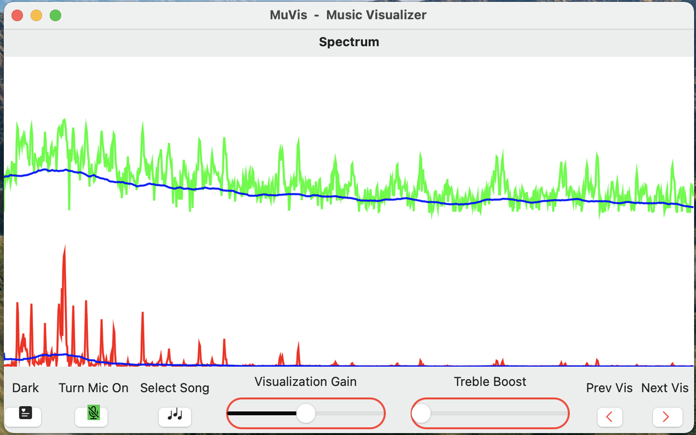

## **MuVis**

MuVis is an open-source multiplatform app (using SwiftUI, Swift, and Xcode) for music visualization. It renders informative (and musically useful) graphical displays in real time from music files being played - or from the device's microphone. Further details are provided in the project's User Guide, Developer Guide, Audio Processing Guide, and Visualizations Guide documents.  (See [here](https://github.com/Keith-43/MuVis-v0.9).)

This app runs on macOS, iOS, and iPadOS devices.
  
Real-time music visualization is an exciting endeavor - providing the user with dynamic visual and aural stimulation and edification.  I am hoping that others will benefit from my research - and perhaps build upon what I have started. I will strive to continuously improve this app as time allows.  Feel free to contact me if you wish to contribute or collaborate.  (I am new to GitHub and Swift programming, so I would appreciate any help from experienced-others who can improve my code.)

When the MuVis app first opens, the on-screen display should look somewhat like:

and the computer's speakers should be playing music from a pre-loaded royalty-free music file. (Currently, the song file is "The Elevator Bossa Nova" from Bensound.com.)  The on-screen display shows a real-time dynamic visual representation of the audio that you are hearing.

Click-and-drag any corner of this window to freely re-size it to any width and height you wish.

On a Mac, the menu bar at the top shows the app's title "MuVis - Music Visualizer", and the toolbar beneath it shows the name "Spectrum" of the particular visualization selected for display.  (These are omitted on an iPhone or iPad, to allow more screen space for the visualizations.)  The bottom toolbar contains buttons and sliders to allow you to control what you see.

At the bottom right are two buttons labelled "Prev Vis" (Previous Visualization) and "Next Vis" (Next Visualization) which allow you to cycle through the twenty-or-so visualizations currently provided by the app.

At the bottom left is a button labelled "Light" which when-clicked toggles the app's window to Light Mode.  (Alternatively, if the window is currently in Light Mode, the button label will be "Dark" and when-clicked will toggle the window into Dark Mode.)

The adjacent button is labelled "Turn Mic On".  When pressed it stops playing the audio from the selected song file (and also stops it's visualization), and starts playing the live audio from the microphone (and starts it's visualization).  The label then becomes "Turn Mic Off" - which, when pressed, performs the reverse actions.

The next button is labelled "Select Song".  When clicked, a sub-window pops up to allow you to select whatever songs you want from your own Music folder.  Selecting a song (by navigating your Artist and Album structures and clicking on its name) causes that song to play - and the visualization to render its dynamic attributes.

The bottom toolbar also contains two sliders - one labelled "Visualization Gain" and the other labelled "Visualization Treble Boost".  As their names imply, sliding them adjusts the gain and slope of the visual data representation.

